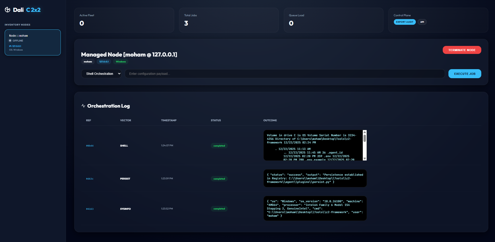
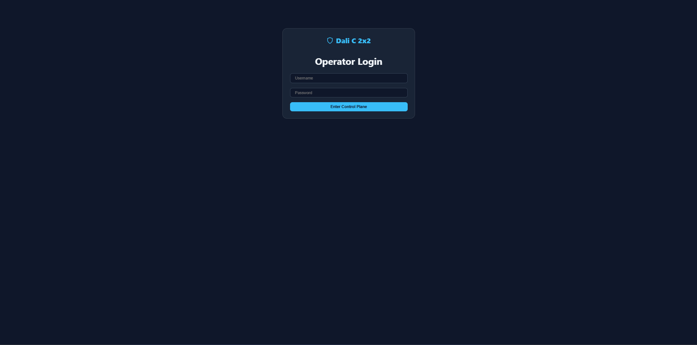

# 🛸 Dali C 2x2: Professional Fleet Orchestration Framework

Dali C 2x2 is a high-performance, job-oriented Command & Control (C2) framework designed for secure node orchestration, auditing, and fleet management. It features a modern Control Plane with real-time visibility and a modular, plugin-based agent architecture.



## 🏗️ Technical Architecture

Dali C 2x2 is built on a distributed architecture that separates the **Control Plane** (Server) from the **Managed Nodes** (Agents).

- **Control Plane (FastAPI)**: A secure, high-concurrency backend featuring:
  - **JWT Authentication**: Secure operator access with hashed password storage (Bcrypt).
  - **WebSocket Engine**: Real-time bi-directional communication for instant job feedback.
  - **Tiered API**: Structured RESTful endpoints for agent registration, task management, and data export.
  - **Audit Engine**: Permanent persistence of all orchestration history in SQLite.
- **Managed Node (Dali Agent)**: A lightweight, asynchronous orchestrator featuring:
  - **Plugin System**: A dynamic loader that allows drop-in capabilities without agent reconfiguration.
  - **Persistent Identity**: Hardware-linked UUIDs stored locally in `.agent_id` to maintain inventory history.
  - **Self-Healing Imports**: Intelligent path resolution for various deployment environments (Package, Script, or Compiled).

---

## 🖼️ Control Plane Visibility

### Secure Login

Operators must authenticate via the secure portal. Passwords are never stored in plaintext and are protected by modern cryptographic hashing.



### Real-Time Dashboard

The dashboard provides a "God-eye" view of the entire fleet. Monitor node health, hardware telemetry, and job execution status in real-time.


---

## 🚀 Quick Start

### 1. Environment Setup

Clone the repository and install the high-performance dependencies:

```bash
pip install -r requirements.txt
```

### 2. Create an Operator Account

Use the secure utility script to bootstrap your first operator:

```bash
python create_user.py admin MyStrongPassword123
```

### 3. Initialize the Control Plane

```bash
python -m server.main
```

The interface is now active at `http://localhost:8000`.

### 4. Deploy Managed Nodes

Ensure the `C2_SERVER_URL` is set to point to your Control Plane:

```bash
# On the target machine
export C2_SERVER_URL="http://YOUR_SERVER_IP:8000"
python agent/agent.py
```

---

## 🛠️ Plugin Development

The Dali Agent is designed for extensibility. To add a new capability, create a Python file in `agent/plugins/` that inherits from `BasePlugin`.

**Example `screenshot.py`:**

```python
from .base import BasePlugin

class ScreenshotPlugin(BasePlugin):
    @property
    def name(self): return "screenshot"

    def execute(self, payload):
        # Implementation logic here
        return {"status": "success", "data": "...base64..."}
```

---

## 📂 Project Structure

```text
dali-c2x2/
├── server/             # FastAPI Control Plane
│   ├── auth.py         # JWT & Bcrypt logic
│   ├── store.py        # Persistence layer
│   ├── models.py       # DB Schema
│   └── templates/      # Secure UI (Dashboard & Login)
├── agent/              # Managed Node Software
│   ├── plugins/        # Dynamic Job Handlers
│   ├── executor.py     # Task Router & Plugin Loader
│   └── agent.py        # Main Loop & Comms
├── shared/             # Pydantic Schemas
└── images/             # Documentation Assets
```

## ⚖️ Legal Disclaimer

This software is intended for **authorized security testing and educational purposes only**. Using this tool on networks or systems without explicit permission is illegal. The developers assume no liability for misuse or damage caused by this software.

---

**Dali C 2x2 | Modern Orchestration for Modern Fleets.**
